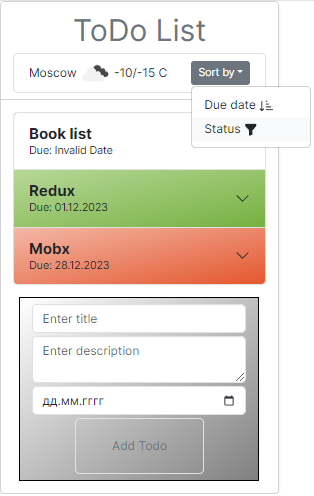
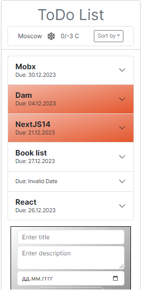
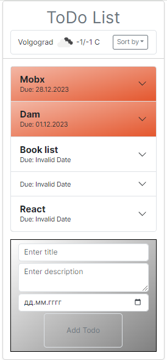

# React-todo-list

[//]: # (#### A project built for resurrecting the countless abandonware repos littering GitHub. The goal is to make it easier to turn any repo, no matter how old, and turn it into a working GitHub Codespace.)
[//]: # (#### Thrilled to introduce the official release of Bootstrap project, your all-in-one note-making app! 🚀)
#### Committed to making Bootstrap project the best note-making app possible. If you have any feedback, suggestions, or encounter any issues, please let us know by opening an issue on GitHub.
#### Showcasing the use of local storage in Next.js with TypeScript, utilizing hooks and context.
[//]: # (Thank  for you choosing. We hope you enjoy this release, and we look forward to enhancing your note-taking journey in the future!)

## 📖 TODO
- Recycle knowledge and refresh mind
- < code />


-------------------------------------------------

### ⚙️ Technology Stack


-------------------------------------------------
### 📝 Local State management
Context data is stored in local storage.


-------------------------------------------------
### ‍💻 Getting Started
```bash
npm run dev
# or
yarn dev
```
Open [http://localhost:3000](http://localhost:3000) with your browser to see the result.

-------------------------------------------------
## ⚙️ Advancement
The demo app is a static site, a basic single-page-app that has a few
addressable pages that are lazy loaded on-demand. It demonstrates basic CRUD
operations: 1) list todo, 2) view todo details, 3) create/edit and 4)
delete a todo.

The demo uses browser localStorage for the data storage, which means it runs
without a backend.

### 📸 Screenshots



#### 💡 Adding Bootstrap
Install Bootstrap and Bootstrap from NPM:
```
npm i bootstrap
```

#### 🌐 Learn More

Original project : [`react-todo-list`](https://github.com/KrisztaT/react-todo-list) - https://github.com/KrisztaT/react-todo-list .

> Work in Progress


